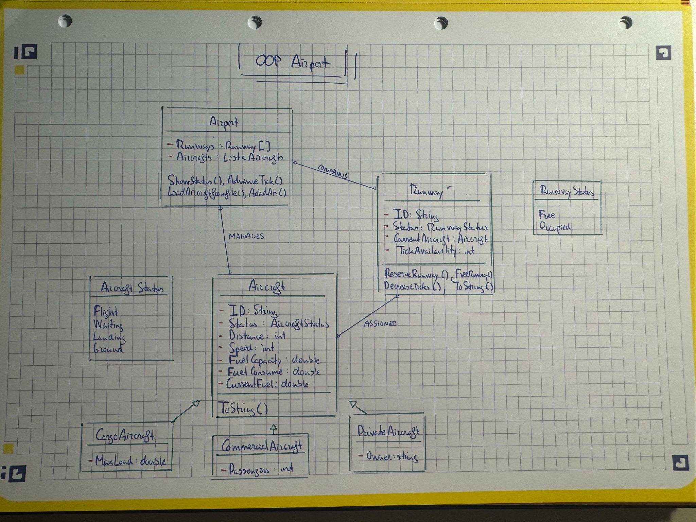

**Computer Engineering**
*Object Oriented Programming*
2025

Practical Work 1 - Airport Landing Simulator 

-----------------Group 9-------------------

Members:

Mario Wenceslao Rivera Córdoba 

Iñaki Quireza Iriberri

Javier López Ranero

## Table of Contents

1. [Introduction](#1-introduction)
2. [Description](#2-description)
    - [Overview of the system](#overview-of-the-system)
    - [Design and Architecture](#design-and-architecture)
    - [Class Diagram](#class-diagram)
3. [Problems encountered](#3-problems-encountered)
4. [Conclusions](#4-conclusions)

## 1. Introduction
   
  This document describes and presents our design of the implementation of an airport simulation
  
  This simulation manages different airplanes landing in a new airport, taking into account the runway management and some variables like fuel or aircraft type

  In this document we explain the design choices, the structure and classes, the challenges we faced and our final conclusions after developing this project

## 2. Description

  ### Overview of the system

  This project is a simulator of an airport with different airplanes landing on it

  This simulation works with ticks, each tick is 15min. Each airplane moves closer to the airport every tick and use fuel depending on variables as speed or fuel consumption

  The planes land at the airport when a runway is free, when landing the runway is occupied and no other airplane can use it. When the plane lands the runway becomes free again

  You can add flights by hand or by a csv file. All actions are available on the menu

  The different types of airplanes are: Cargo, Passenger and Private. Each one has their unique characteristic in addition to those of the airplanes in general

  ### Design and Architecture

  This simulator is organized in different classes

  -Aircraft (Abstract):
  This is the base class for all the airplanes. It has the common atributes: ID, Status, distance to airport, speed, fuel capacity, fuel consumption and current fuel.
  There are 3 types of aircraft:

  Cargo plane: Has a maximum load in kg
  
  Passengers plane: Has a number of passengers
  
  Private plane: Has a owner name

  -Runway:
  It is a single runway of the airport, it has an ID, its current status (free or occupied), the aircraft currently landing, and the ticks until its free.

  -Airport:
  This class is the one that manages the entire simulation. It has the aircrafts and runways and has the methods to show the status, advance the simulation with a tick, load flights and add flights.

  -Enums:

  AircraftStatus: Possible states of the Aircraft (Flight, landing, ground and waiting)

  RunwayStatus: Possible states of the aircraft (Free, occupied)

### Class Diagram

 ## 3. Problems encountered

 During the development of this project we faced a lot of problems

 - Our group was made 10 days before the deadline and we didnt know each other
 - One of the mates didnt do anything because of family problems
 - There was lack of communication
 - Using github by some mates was difficult at first
 - No one did their assignments on time. They said they would have some class done by some exact time and they didnt have them
 - We didnt have the opportunity to be sure about our job because of this previous things I mentioned
 - The organisation has been a disaster

   Despite this problems we were able to make a good repository, complete the code with the requirements (and to make it compile) and send the project on time

 ## 4. Conclusions

With this project we learned how to use what we learned in object-oriented programming to build a simulation with classes and using inheritance.

We worked in GitHub, it helped us understand teamwork and how to organize code.

The organization was not easy, and sometimes we had problems communicating.  
Finishing things on time was a big issue too.
This taught us why it is important to plan and coordinate in a group.

We also improved our skills writing code.

In the end, we finished an airport simulator that follows the main requirements of the assignment.  
With more time or better organisation, we could have improved some things, but with the situation we had, we are satisfied with the result.

